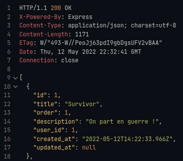

# Mise en place API

## Phase Architecture

Mettre en place l'architecture d'un projet respectant une API REST (REpresentational State Transfer) :
*RESTful est un adjectif pour dire qu'une API respecte bien les standards de REST*

- Création d'un dossier `app/controllers`.
    - Création des différents controllers (list, card, user, tag)
    - Sans oublier la mise en place d'un gestionnaire d'erreur simple `errorController.js`
 ```js
    // ERRORCONTROLLER
    function _400(req, res) { 
    res.status(400).send('BAD REQUEST')};

    function _401(req, res) { 
    res.status(401).send('AUTHENTIFICATION ERROR')};

    function _403(req, res) {
    res.status(403).send('ACCESS DENIED')};

    export default function _404(req, res) {
    res.status(404).send('PAGE 404 NOT FOUND')};

    function _500(err,req, res) {
    res.status(500).send(err.message); 
    // res.status(500).json({"Error 500" : err.message}); version pour avoir un json lors de nos phase seeding
    };
    export { _400, _401,_403, _500 };
```

### Les Méthodes HTTP et SEQUELIZE Associées aux Opérations C.R.U.D

<!-- EN COURS D'ANALYSE
|   CREATE   |           READ           |   UPDATE    | DELETE  |
| :--------: | :----------------------: | :---------: | :-----: |
| POST / PUT |           GET            | PATCH / PUT | DELETE  |
|   create   | findAll / findByPK / ... |   update    | destroy |


Les méthodes [PUT](https://developer.mozilla.org/en-US/docs/Web/HTTP/Methods/PUT) , [POST](https://developer.mozilla.org/en-US/docs/Web/HTTP/Methods/POST) et [PATCH](https://developer.mozilla.org/en-US/docs/Web/HTTP/Methods/PATCH) ont des significations différentes :

**PUT**, remplace les données par celle qui sont envoyées dans la requête.

**PUT** doit contenir toutes les valeurs (**NOT NULL** obligatoire) de la table pour valider la requête correctement, pour les autres valeurs (**NULL** autorisé) non indiqué il les remplacera automatiquement par la valeur **null**;

Si l'entité n'existe pas alors **PUT** (aura le même résultat qu'un **POST**) il va générer une nouvelle entité, mais si elle existe alors **PUT** (aura le même résultat qu'un **PATCH**) 

**PATCH**, permet la modification partielle d'une ressource en fusionnant les données envoyées avec les données déjà présentes ou grâce à l'utilisation d'opération de modification.

**La seule contrainte sur la méthode PUT est qu’elle doit être idempotente. Le nombre d’exécution d’une même requête ne doit pas impacter le résultat.** -->

## Créations de nos premières function dans notre listController

```js
    // On peut avoir comme parametre attributes, include, order
    const allList = await List.findAll({
                attributes: {
                    exclude: ['id', 'user_id', 'created_at', 'updated_at']
                },
                include: [

                    {
                        model: Card,
                        as: 'cards',
                        attributes: {
                            exclude: ['id', 'order', 'user_id', 'list_id', 'color', 'created_at', 'updated_at']
                        }
                    }, 
                    // Exemple de rajout d'un autre model avec pour attributes un exclude
                    // {
                    //     model: User,
                    //     as: 'user',
                    //     attributes: {
                    //         exclude: ['id', 'avatar', 'email', 'password', 'created_at', 'updated_at']
                    //     }
                    // }
                ],
                order: [
                    ["cards", "order", "ASC"]
                ]
            });
            res.json(allList);
```


```js
    // Exemple de function (ici update pour la méthode PATCH)
    async function updateList(req, res){
        try {

        const update = await List.update( 

            //! Attention l'ordre est important [values, conditions]
            // pour un update ou un upsert

            // On a dans un premier temps les values à modifier
            { title : 'Trop content !!!!!'},
            // Dans un second temps les conditions
            { where : {id:10} },
            );
        console.log(update);

        } catch (err) {
            _500(err, req, res);
        }
    }
```

## Créations de nos premières routes

- Création d'un dossier router et d'un fichier index.js regroupant tout les autres routers nommés par utilités list, card, user, tag.
```js 
    // INDEX.JS (ROUTER)
    import {Router} from 'express';
    const router = Router();

    // ~ ---------------------------------------------- MAIN ROUTER
    // Avec l'utilisation du type "module" ES6 on peut renommer notre
    // import de router venant de main.js avec l'aide de "as"
    import { router as mainRouter } from './main.js'; 
    router.use('/', mainRouter);

    // ~ ---------------------------------------------- CARD ROUTER
    import { router as cardRouter } from './card.js';
    router.use('/', cardRouter);

    // ~ ---------------------------------------------- ...ETC
    
    export { router };
```
Exemple d'un router "list" exporter vers l'index.js (router)
```js
    // EXEMPLE FICHIER ROUTER list.js
    import {Router} from 'express';
    import { fetchAllList,createList, fetchOneLIst, updateList, deleteList } from '../controllers/listController.js';

    const router = Router();

    //* --------------------------- LISTS
    router.get('/lists', fetchAllList);
    router.post('/lists', createList);

    router.get('/lists/:id', fetchOneLIst);
    router.patch('/lists/:id', updateList);
    router.delete('/lists/:id', deleteList);

    export { router };
```

## Démarrage de la phase "Seeding"
Définition SEEDING : Terme anglo-saxon utilisé pour designer la démarche qui consiste à introduire de fausses coordonnées (dummy names) dans un fichier d’adressage, soit pour vérifier la validité du routage sur des adresses test, soit pour contrôler que le fichier n’est pas utilisé de manière illégale.


| URL        | GET                            | POST                                           | PATCH                               | DELETE                          | PUT                                 |
| ---------- | ------------------------------ | ---------------------------------------------- | ----------------------------------- | ------------------------------- | ----------------------------------- |
| /lists     | récupérer toutes les listes    | créer une liste                                | mettre à jour toutes les listes (❌) | supprimer toutes les listes (❌) | remplacer toutes les listes (❌)     |
| /lists/:id | récupérer UNE liste via son ID | créer une listes en fixant son id d'avance (❌) | mettre à jour une liste via son ID  | supprimer une liste via son ID  | remplacer entièrement liste (❌)     |
|            |
| /cards     | récupérer toutes les cartes    | créer une carte                                | mettre à jour toutes les cartes (❌) | supprimer toutes les cartes (❌) | remplacer toutes les cartes (❌)     |
| /cards/:id | récupérer UNE carte via son ID | créer une carte en fixant son id d'avance (❌)  | mettre à jour une carte via son ID  | supprimer une carte via son ID  | remplacer entièrement une carte (❌) |
|            |
| /tags      | récupérer tous les labels      | créer un label                                 | mettre à jour tous les labels (❌)   | supprimer tous les labels (❌)   | remplacer tous les labels (❌)       |
| /tags/:id  | récupérer UN label via son ID  | créer un label en fixant son id d'avance (❌)   | mettre à jour un label via son ID   | supprimer un label via son ID   | remplacer entièrement un label      |


(❌) = ne pas faire

### Utilisation de l'extension Vscode [REST client](https://marketplace.visualstudio.com/items?itemName=humao.rest-client)
    - Création d'un fichier test.http
    - Création de nos requêtes test
```js
# --------------------------------- LIST 
GET http://localhost:5000/lists
###
POST http://localhost:5000/lists
###
GET http://localhost:5000/lists/:id
###
PATCH  http://localhost:5000/lists/:id
###
PUT http://localhost:5000/lists/:id
###
DELETE http://localhost:5000/lists/:id
```
    - CTRL + ALT + R  => lancement de la requête
    - CTRL + ALT + H => Historique de toutes nos requêtes lancés
Résultat du Seeding pour la requête GET

#### Attention lors des tests
- Quand on reset la base de donnée, il faut penser à recrée un user 
    - Type d'erreur lors d'un utilisateur manquant lié à la list: `insert or update on table "list" violates foreign key constraint "list_user_id_fkey"`



[Retour à l'accueil](../README.md)

