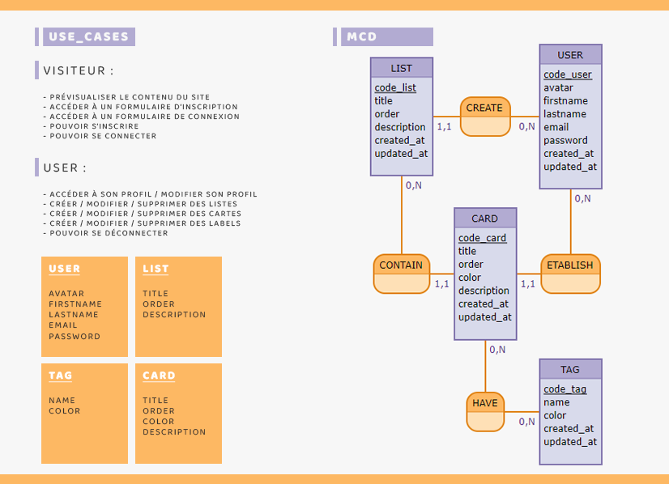
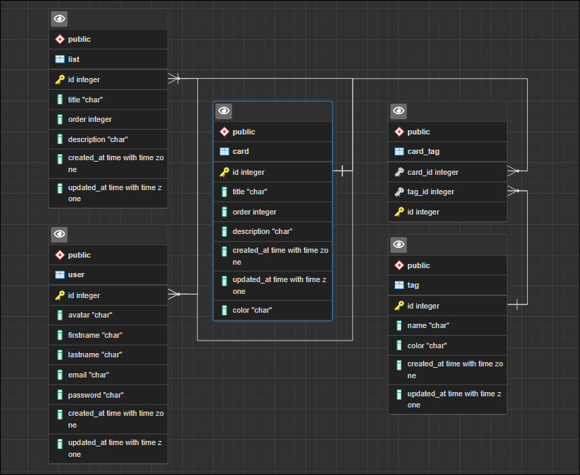

# Jour 01

## Réalisation du projet par (TEAM :  [Hélène NGUYEN](https://github.com/helene-nguyen) / [Gaëtan SANTUCCI](https://github.com/GaetanSantucci) / [Frédéric BASLER](https://github.com/Megafredo))

Instruction :
On refait Trello !

- On souhaite créer une application de type Kanban où il est possible de créer des cartes à l'intérieur de listes.
- L'utilisateur peut créer autant de listes qu'il désire et mettre autant de cartes à l'intérieur de ces listes.
- Chaque liste dispose d'un nom.
- Chaque carte dispose d'un titre, d'une position au sein de la liste, d'une couleur (optionnelle) et d'un ou plusieurs label(s) (optionnel(s))

On se base sur ce besoin pour créer le MCD de l'application.

## Mise en place du Use cases (ou user stories) et du MCD :

#### USE CASES

| En tant que | Je veux pouvoir | Dans le but de |
|---|---|---|
| Visiteur | accéder à la page d'accueil | prévisualiser le contenue du site |
| Visiteur | accéder à un formulaire d'inscription| s'inscrire |
| visiteur | accéder à un formulaire de connexion | se connecter |
|...|...|...|
| Utilisateur | accéder à son profil | voir ses informations |
| Utilisateur | modifier son profil | modifier ses informations |
| Utilisateur | se déconnecter | clôturer la session de l'utilisateur |
| Utilisateur | créer une liste | ajouter une liste au kanban |
| Utilisateur | modifier une liste | modifier une liste du kanban |
| Utilisateur | déplacer une liste | déplacer l'ordre d'une liste dans le kanban |
| Utilisateur | supprimer une liste | supprimer une liste du kanban |
| Utilisateur | créer une carte | ajouter une carte dans une liste |
| Utilisateur | modifier une carte | modifier une carte dans une liste |
| Utilisateur | déplacer une carte | déplacer l'ordre d'une carte dans une liste |
| Utilisateur | supprimer une carte | supprimer une carte dans une liste |
| Utilisateur | créer une label | ajouter un label à une liste |
| Utilisateur | modifier une label | modifier un label à une liste |
| Utilisateur | supprimer une label | supprimer un label à une liste |
|...|...|...|


#### OUTIL MOCODO : 

    LIST: code_list, title, order, description, created_at, updated_at,
    CREATE, 0N USER, 11 LIST
    USER: code_user, avatar, firstname, lastname, email, password, created_at, updated_at,

    CONTAIN, 0N LIST, 11 CARD
    CARD : code_card, title, order, color,  description, created_at, updated_at,
    ETABLISH, 0N USER, 11 CARD

    :
    HAVE, 0N CARD, 0N TAG
    TAG : code_tag, name, color, created_at, updated_at,


#### FINAL USE_CASES + MCD



## Mise en place du MLD : 
```js
    USER ( code_user, avatar, firstname, lastname, email, password, created_at, updated_at, )
    LIST ( code_list, title, order, description, created_at, updated_at, , #code_user )
    CARD ( code_card, title, order, color, description, created_at, updated_at, , #code_user, #code_list )
    TAG ( code_tag, name, color, created_at, updated_at, )  
    HAVE ( #code_card, #code_tag )
```
## Mise en place du MPD :




[Retour à l'accueil](../README.md)