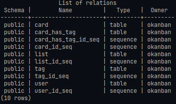
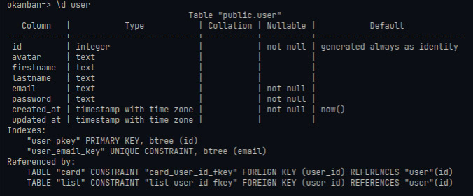
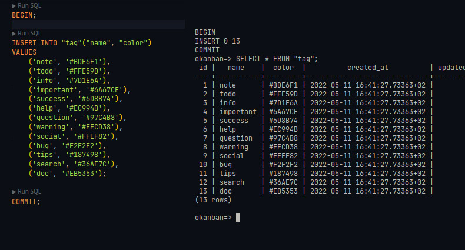

# Jour 02

## Création de la base de donnée, utilisateur, password (dans postgres)
```sql
sudo -i -u postgres psql

CREATE ROLE "okanban" WITH LOGIN PASSWORD 'okanban';
CREATE DATABASE "okanban" OWNER "okanban";
\c okanban okanban
```
## Création de la base de donnée (dans notre APP) & installation sur postgres

On commence par crée un fichier 01-Import_table.sql

```sql
    Etape de création :
    BEGIN;
  
    DROP TABLE IF EXISTS "user", "list", "card", "tag", "card_has_tag";

    CREATE TABLE IF NOT EXISTS "user" (
    "id" INTEGER GENERATED ALWAYS AS IDENTITY PRIMARY KEY,
    "avatar" TEXT NULL,
    "firstname" TEXT NULL,
    "lastname" TEXT NULL,
    "email" TEXT NOT NULL UNIQUE,
    "password" TEXT NOT NULL,
    "created_at" TIMESTAMPTZ NOT NULL DEFAULT NOW(),
    "updated_at" TIMESTAMPTZ
    );

    CREATE TABLE IF NOT EXISTS "card_has_tag" (

    "id" INTEGER GENERATED ALWAYS AS IDENTITY PRIMARY KEY,
    "card_id" INTEGER NOT NULL REFERENCES "card"("id"),
    "tag_id" INTEGER NOT NULL REFERENCES "tag"("id"),
    UNIQUE("card_id", "tag_id")
);

    COMMIT;
```
    // Commentaire :
    -- une clé primaire est automatiquement NOT NULL. Pas besoin de le préciser lors de la création d'une table.
    -- On spécifie que la colonne sera généré automatiquement par la BDD en suivant une séquence numérique prédéfinie de 1 en 1
    -- On peut définir BY DEFAULT (surcharge de la valeur possible) ou ALWAYS (surcharge de la valeur impossible)
    -- Si on utilise BY DEFAULT on défini nous même les valeurs des clé primaires dans les insertions du fichier import_data.sql
    -- Mais on utilisera plus généralement ALWAYS afin de sécurisé l'incrémentation des valeurs du champ

    // Attention : LORS DE L'UTILISATION DE BY DEFAULT
    Rajout de la valeur courante de chacune des séquence en selectionnant l'id max

*Postgres avec le fait d'ajouter IDENTITY BY DEFAULT au lieu de ALWAYS ne met pas à jour le curseur de l'incrément de la séquence de façon implicite -- Il faut donc mettre à jour la valeur courante de chacune des séquences en séléctionnant l'id maximum de chaque table dans l'import_data !*

```sql
    Exemple :
    SELECT setval('user_id_seq', (SELECT MAX(id) from "user"));
```
---
## Résultats





## Création d'un import_data pour les tags & installation




[Retour à l'accueil](../README.md)
